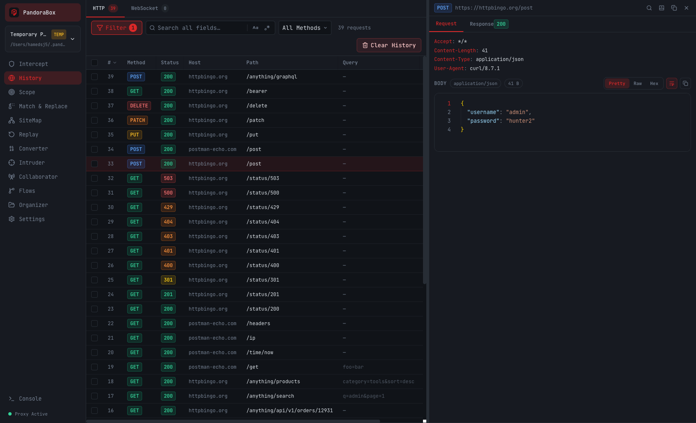
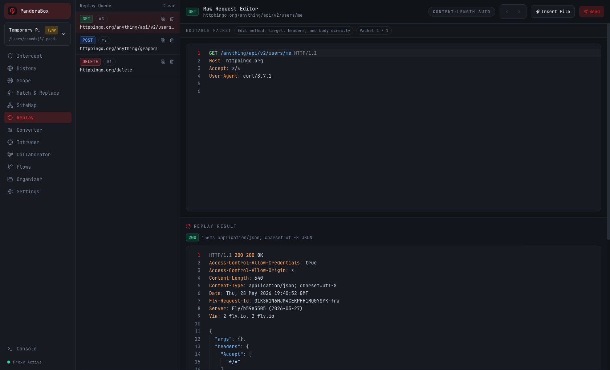
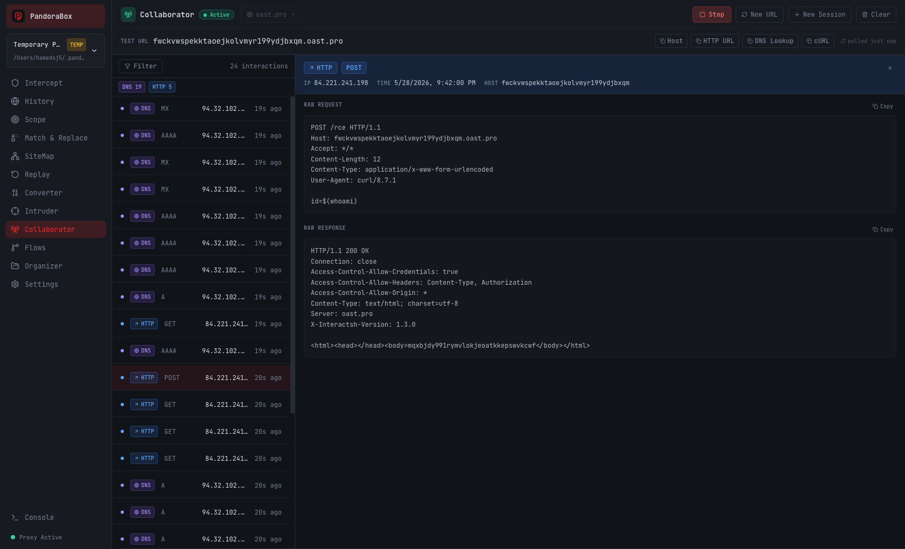

<div align="center">


# PandoraBox

**A programmable MITM proxy — intercept, inspect, replay, and script HTTP/HTTPS traffic — with a built-in MCP server so an AI agent can drive it.**

[**Download**](https://github.com/hamedsj/PandoraBox/releases/latest) · [Quick start](#quick-start) · [MCP](#mcp--let-an-ai-drive-the-proxy) · [Docs](wiki/features.md)


</div>

<p align="center">
  
  
  
</p>
<p align="center"><sub>History &amp; inspector&nbsp;·&nbsp;Replay editor&nbsp;·&nbsp;Collaborator (out-of-band)</sub></p>

---

## Download

**The easy way — grab a pre-built app from the [Releases page](https://github.com/hamedsj/PandoraBox/releases/latest).** No build step.

| OS | File | Notes |
|----|------|-------|
| macOS · Apple Silicon | `PandoraBox-…-arm64.dmg` | |
| macOS · Intel | `PandoraBox-….dmg` | |
| Windows | `PandoraBox-…-win.zip` | Portable — unzip and run `PandoraBox.exe` |
| Linux | `PandoraBox-….AppImage` · `.deb` | |

> Builds are **unsigned**. macOS: right-click the app → **Open** (or `xattr -dr com.apple.quarantine PandoraBox.app`). Windows: **More info → Run anyway**.

Prefer the terminal? Any release also runs headless:

```bash
./pandorabox serve      # web UI at http://localhost:7777
```

---

## Quick start

1. **Run it** — open the app (or `pandorabox serve`). The UI is at `http://localhost:7777`.
2. **Trust the CA** — **Settings → Certificate** installs the root CA with per-platform steps, so HTTPS decrypts cleanly.
3. **Point your browser** at the proxy: `127.0.0.1:8080`.

Traffic now streams into **History** in real time.

---

## What it does

- **History & Inspector** — live capture with Pretty / Raw / Hex views, decoded bodies, and full-text + regex search.
- **Intercept** — hold, edit, forward, or drop requests in real time.
- **Replay** — edit the full raw packet and resend; back/forward through every sent packet and its response.
- **Scope · Match & Replace · SiteMap** — include/exclude rules, on-the-fly rewrites, and a host/path tree with HAR export.
- **Intruder** — fuzz a request across payload sets.
- **Collaborator** — an interactsh-backed host that catches blind DNS/HTTP/SMTP callbacks (SSRF, XXE, RCE).
- **Flows · Python middleware** — chain requests and script traffic programmatically.
- **Projects** — per-project SQLite storage and configuration.

Full walkthrough → [wiki/features.md](wiki/features.md)

---

## MCP — let an AI drive the proxy

PandoraBox runs an MCP server (default `http://localhost:9090/mcp`) so Claude — or any MCP client — can read traffic, replay requests, manage scope, and control the proxy in plain language.

Add it to your client config (e.g. Claude Desktop's `claude_desktop_config.json`):

```json
{
  "mcpServers": {
    "pandorabox": { "url": "http://localhost:9090/mcp" }
  }
}
```

Then just ask:

```
"Show every POST to api.example.com, then replay #47 with a Bearer token."
"Turn on interception and forward everything except /admin."
"Set scope to *.example.com only."
```

Works with Claude Desktop, Claude Code, Codex, Gemini, and Qwen. Toggle it off per project in **Settings → MCP**. Full tool reference → [wiki/mcp.md](wiki/mcp.md)

---

## Build from source

Requires **Go 1.23+** and **Node 18+**.

```bash
git clone https://github.com/hamedsj/PandoraBox.git
cd PandoraBox
make build          # npm build → embed UI → go build
./bin/pandorabox serve
```

Desktop app: `make dev-electron` to run · `make electron-mac` / `electron-win` / `electron-linux` to package.

> Always use `make build`, never `npm run build` alone — the Go binary embeds the React bundle that the Makefile copies into place.

---

## Docs

| | |
|---|---|
| [Features](wiki/features.md) | Every page and option |
| [MCP](wiki/mcp.md) | Full tool reference |
| [API](wiki/api.md) | REST + WebSocket |
| [Architecture](wiki/architecture.md) | Packages and data flow |
| [Development](wiki/development.md) | Workflow and build pipeline |
| [Database](wiki/database.md) | SQLite schema |

---

<div align="center"><sub>Apache-2.0 · For authorized security testing, CTFs, and research only.</sub></div>
